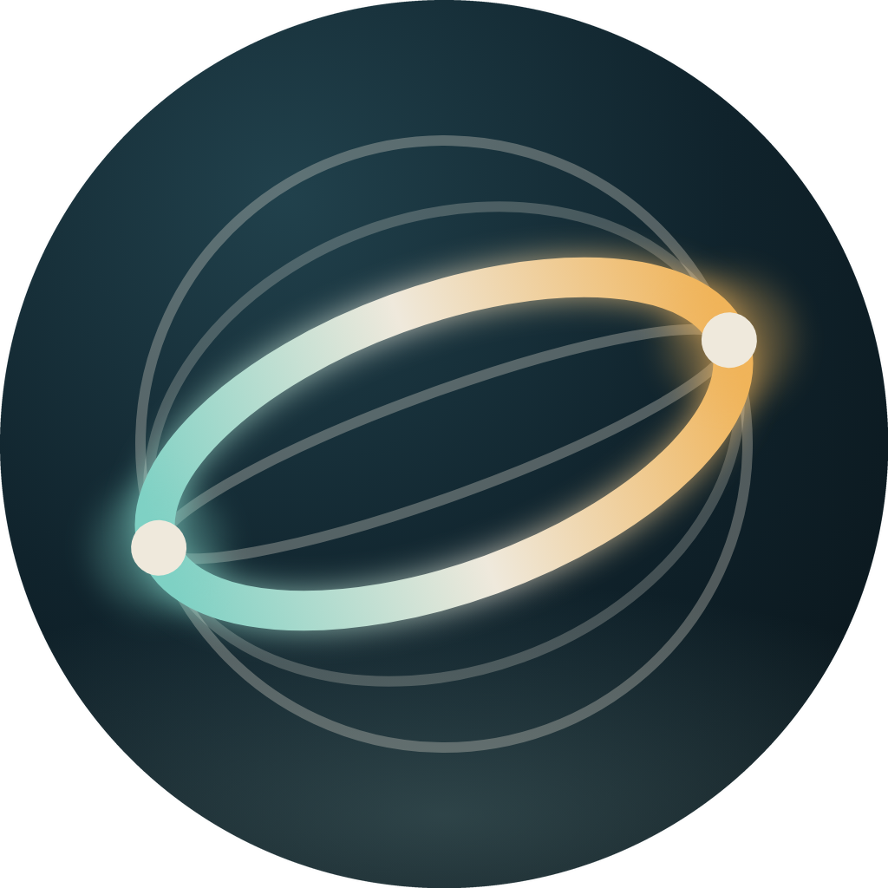

# Unwind



**给肩颈几分钟，让身体慢下来。**

Unwind 是一款基于 PICO Spatial SDK 的原生空间应用，将肩颈舒展、轻运动与呼吸放松融入沉浸式体验。通过头显与手部追踪，用户可以完成活动度测试和互动练习，查看自己的历史变化，逐步养成日常活动习惯。

当前版本：**1.0**（`versionCode = 1`）。

## 功能

| 功能 | 说明 |
| --- | --- |
| 颈部活动度测试 | 测量左旋、右旋、前屈、后仰、左侧屈、右侧屈六个方向，展示各方向角度和左右差异。 |
| 视线接光球 | 通过头部朝向跟随空间光球；根据测量结果设置运动边界，并可自动调整左右目标分配。 |
| 肩部环绕 | 跟随空间引导环完成手部环绕动作，记录向前、向后的圈数。 |
| 节奏出拳 | 结合手部追踪、节拍和视觉反馈完成出拳互动。 |
| 三环呼吸 | 光环随呼吸节奏展开、收拢；吸气 4 秒、呼气 6 秒，共 12 次、2 分钟。 |
| 历史记录 | 查看活动度趋势、各方向读数和最近四周的记录日历。 |
| 个性化设置 | 支持坐姿/站姿选择、工作日提醒、引导环大小、环境音量及重新校准。 |
| 数据管理 | 本地保存测量与练习记录，支持 CSV 导出和删除全部数据。 |

日常练习依次包含活动度测试（约 30 秒）、视线接光球（90 秒）、肩部环绕（90 秒）和出拳（60 秒）。也可以选择“只做测试”，或在“课程”中单独进入三环呼吸。

## 空间体验

- 全沉浸式 Stage，结合空间面板、三维光环和练习目标。
- 星空、流星和星簇等环境元素，配合环境音与动作提示。
- 头显追踪用于头部角度计算，手部追踪用于环绕和出拳练习。
- 支持暂停、跳过当前方向和进入下一个练习。

## 技术栈

| 层级 | 技术 |
| --- | --- |
| 语言 | Kotlin 2.1.20 |
| 平台 | Android，`compileSdk / minSdk / targetSdk = 35`，`arm64-v8a` |
| 空间能力 | PICO Spatial SDK，BOM 6.1.9，Spatial Core 与实体场景 |
| 界面与交互 | SpatialUI、Compose、空间悬停与触觉反馈 |
| 追踪 | HMDTrackingProvider、HandTrackingProvider |
| 状态管理 | AndroidX ViewModel、StateFlow、Kotlin Coroutines |
| 数据存储 | SQLite、SharedPreferences；通过 MediaStore 导出 CSV |
| 构建与测试 | Gradle 8.13、Android Gradle Plugin 8.13.2、JUnit 4 |

## 构建与运行

### 环境准备

- Android Studio 或可用的 Android SDK，安装 Android SDK Platform 35。
- JDK 21，并将 `JAVA_HOME` 指向本机 JDK 安装目录；仓库的设备工具脚本也默认使用 JDK 21。
- 构建时需能够访问 `settings.gradle.kts` 中配置的 Google、Maven Central 和 Volcengine Maven 仓库。
- 运行时需要支持所用 PICO Spatial SDK 的 PICO 空间运行环境，以及满足 API 35、`arm64-v8a` 要求的设备。

### 获取代码

```bash
git clone https://github.com/chengchaoccss/Unwind.git
cd Unwind
```

在 Android Studio 中打开项目并配置 Android SDK，或在本地 `local.properties` 中设置 `sdk.dir`。该文件已被 Git 忽略。

### 构建调试包

```bash
./gradlew :app:assembleDebug
```

生成的 APK 位于：

```text
app/build/outputs/apk/debug/app-debug.apk
```

### 安装到头显

如已配置 `pico-cli` 并连接设备，可使用以下命令。将 `YOUR_DEVICE_ID` 替换为实际设备 ID。

```bash
pico-cli app stop com.armilla.neckcare -d YOUR_DEVICE_ID
pico-cli app install app/build/outputs/apk/debug/app-debug.apk -d YOUR_DEVICE_ID -r
pico-cli app launch com.armilla.neckcare --activity .platform.LaunchActivity -d YOUR_DEVICE_ID
```

首次安装时可跳过 `app stop`；更新安装前先停止正在运行的应用，避免旧进程和旧 Stage 干扰启动。

首次进入应用会依次显示健康提示、练习姿势选择和提醒设置，之后进入首页。应用包名为 `com.armilla.neckcare`。

### 单元测试

```bash
./gradlew :app:testDebugUnitTest
```

仓库包含头部角度计算、活动度分析、测量停留记录、各类练习逻辑及 ViewModel 的单元测试。空间呈现与设备追踪效果需在相应运行环境中验证。

## 录屏与截图

`tools/record.sh` 通过头显系统录制服务采集单眼视图，并拉取视频，需要可用的 `pico-cli` 与已连接的头显：

```bash
bash tools/record.sh 20 demo.mp4 YOUR_DEVICE_ID
```

`tools/look.sh` 可以构建、安装、启动应用，录制短视频并用 `ffmpeg` 提取一张画面。使用前配置本机 `JAVA_HOME` 与实际设备 ID，确保 `pico-cli` 和 `ffmpeg` 可用：

```bash
export PICO_CLI_DEVICE=YOUR_DEVICE_ID
bash tools/look.sh /tmp/unwind-preview 7
```

输出文件为 `/tmp/unwind-preview.mp4` 和 `/tmp/unwind-preview.jpg`。以上媒体文件是运行脚本后生成的素材，仓库当前未附带演示视频或应用截图。

## 项目结构

```text
app/src/main/java/com/armilla/neckcare/
├── Main.kt             # 空间应用入口
├── platform/           # 应用启动、依赖容器、提醒与音频
├── domain/
│   ├── model/          # 测量、方向与练习结果模型
│   └── usecase/        # 角度计算、测量状态机与练习逻辑
├── data/repository/    # SQLite 记录、偏好设置与 CSV 导出
├── scene/              # 三维场景、环境、几何与帧更新
└── ui/                 # 首页、练习、结果、记录、设置与主题

app/src/test/           # 单元测试
app/src/androidTest/    # Android 仪器测试
tools/                  # 图标源文件、设备录屏与预览脚本
```

应用展示名称为 Unwind；部分源码、主题和 Gradle 工程名称保留了早期名称 Armilla。

## 数据与使用说明

测量与练习记录保存在本机 SQLite 数据库中，设置保存在 SharedPreferences。CSV 可从设置页导出到设备的 `Documents/Armilla/` 目录。“删除全部数据”会清除应用内记录与设置，并回到首次使用流程；已导出的 CSV 文件需自行管理。

Unwind 用于帮助养成活动习惯，不能代替医生的诊断和治疗。练习时应缓慢移动到自然舒适的位置，并遵循应用内的健康提示。

## 1.0 版本公告

首版提供六方向颈部活动度测试、视线接光球、肩部环绕、节奏出拳及三环呼吸课程；支持结果展示、历史趋势、自动调整光球练习、工作日提醒和 CSV 导出，配备沉浸式空间场景与声音反馈。

## 项目仓库

[chengchaoccss/Unwind](https://github.com/chengchaoccss/Unwind)
